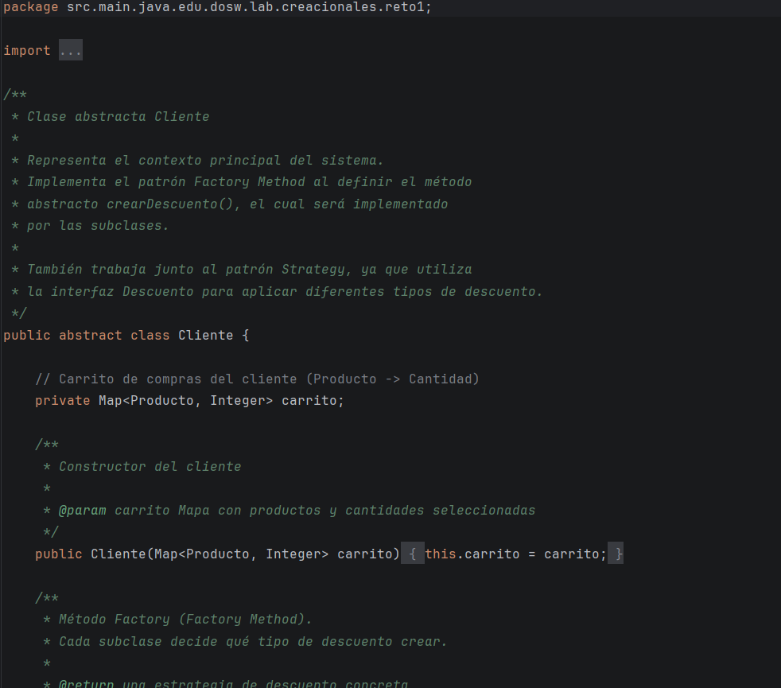
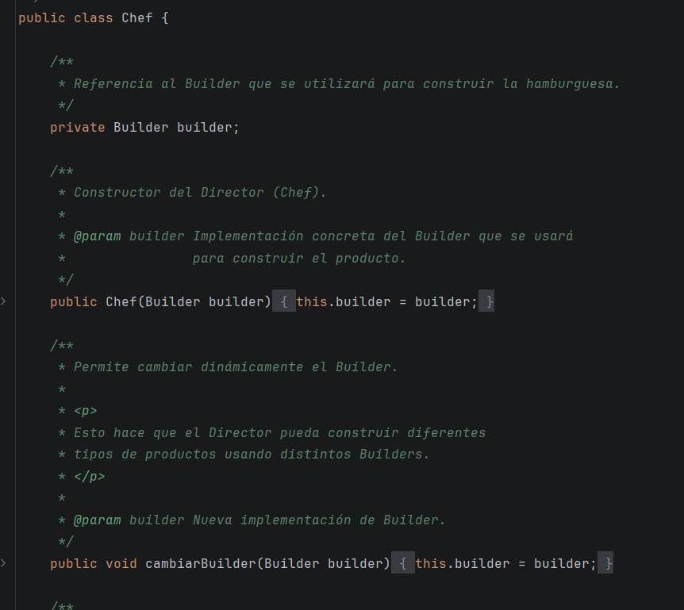
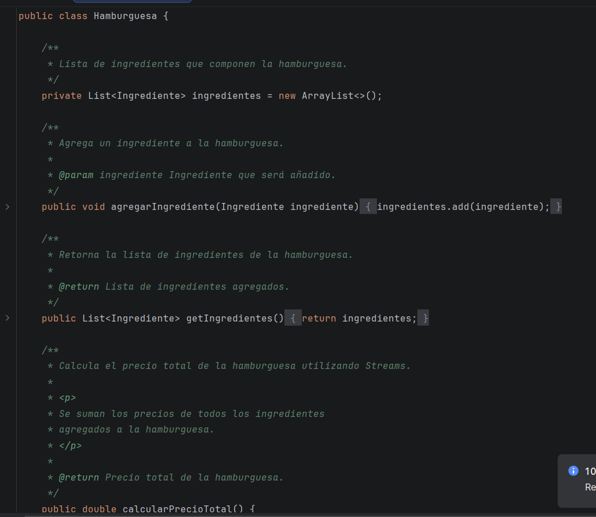
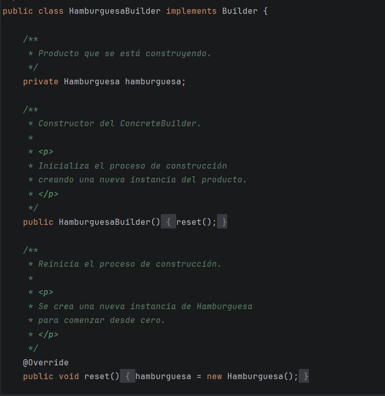
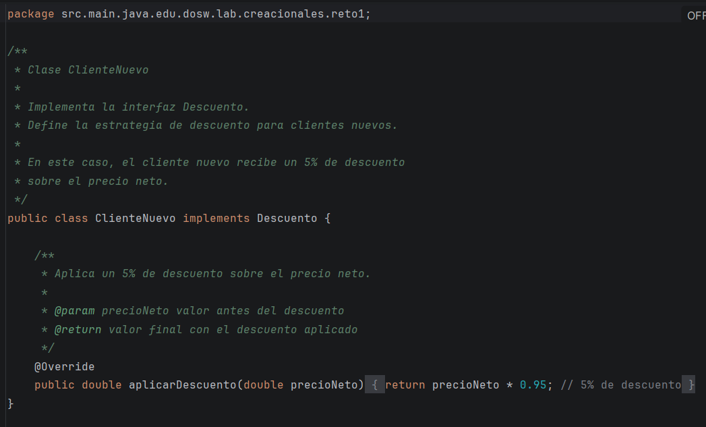
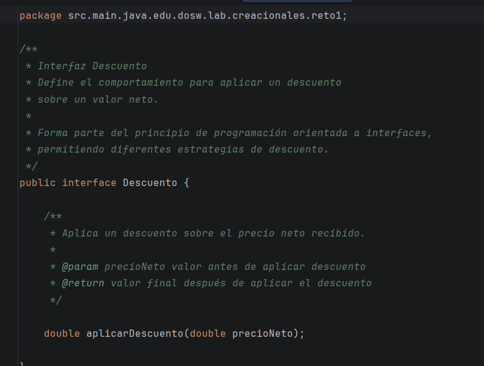
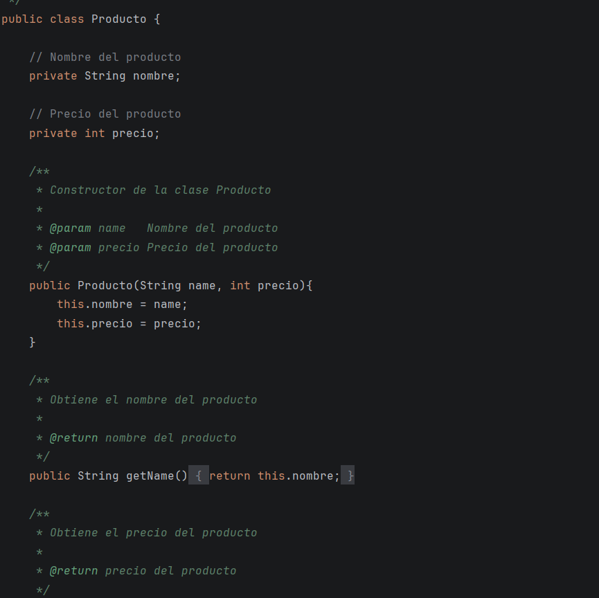

# LABORATORIO 2: SOLID – Patrones de Diseño – Diagramación UML Clases y POO Avanzada

## PREGUNTAS INICIALES: 
1. ¿Qué ventaja ofrece el polimorfismo en el diseño de clases frente al uso de 
múltiples condicionales para determinar el comportamiento de un objeto?

El polimorfismo permite que un mismo método tenga diferentes comportamientos según el objeto que lo implemente, evitando el uso de múltiples estructuras condicionales. Esto mejora la legibilidad del código, facilita la extensibilidad del sistema y reduce la posibilidad de errores al agregar nuevos comportamientos sin modificar el código existente.

2. ¿Por qué una clase inmutable puede mejorar la seguridad?

Una clase inmutable mejora la seguridad porque su estado no puede modificarse después de su creación. Esto evita cambios accidentales o no autorizados en los datos, garantiza la consistencia del objeto y facilita el manejo seguro en entornos concurrentes.

3. Según el principio de Abierto/Cerrado, ¿cómo deberíamos modificar el 
sistema si queremos añadir una nueva funcionalidad sin alterar el código 
existente?

Según el principio de Abierto/Cerrado, el sistema debe extenderse mediante nuevas clases o implementaciones, utilizando herencia o interfaces, en lugar de modificar el código ya existente. De esta manera se agregan nuevas funcionalidades sin afectar las ya implementadas.

4. ¿Qué es y por qué usamos el pom.xml? 

El archivo pom.xml es el archivo principal de configuración de un proyecto Maven. Se utiliza para definir las dependencias, plugins, versión del proyecto y el ciclo de vida de construcción, permitiendo automatizar y estandarizar el proceso de compilación y empaquetado.

5. ¿Qué diferencia hay entre mvn compile, mvn package y mvn install?

- mvn compile: compila el código fuente del proyecto.

- mvn package: compila el código y genera el archivo empaquetado (JAR o WAR).

- mvn install: compila, empaqueta e instala el artefacto en el repositorio local de Maven para que pueda ser usado por otros proyectos.

6. ¿Qué diferencia existe entre una interfaz y una clase abstracta?

Una interfaz define un conjunto de métodos que una clase debe implementar, sin proporcionar implementación ni estado. Una clase abstracta puede contener métodos abstractos y métodos con implementación, así como atributos, y sirve como una base común para clases relacionadas.

## Retos completados

---

### Reto 1 – El problema de la tienda de Don Pepe
#### Implementación
## Cliente

---

#### Evidencia de la respuesta ejecutada

---
#### Lo solicitado en cada Reto

- ¿Cómo está aplicando en su solución cada uno de los principios SOLID?

En la solución se aplican los principios SOLID porque cada clase tiene una función específica (por ejemplo, Producto solo representa datos y Descuento solo aplica descuentos), y el sistema permite agregar nuevos tipos de descuento sin modificar las clases existentes. Además, la clase Cliente trabaja con la abstracción Descuento en lugar de depender de clases concretas, lo que hace el diseño más flexible y organizado.

- ¿Cómo están aplicando polimorfismo en tu solución?

El polimorfismo se aplica cuando el programa usa la interfaz Descuento sin saber qué tipo específico de descuento está ejecutando. Dependiendo del tipo de cliente, se aplica automáticamente el descuento correspondiente (nuevo o antiguo), sin necesidad de usar condicionales.

---

### Reto 2 – El chef de 5 estrellas

#### Evidencia del código solución implementado

#### Evidencia de la respuesta ejecutada

#### Lo solicitado en cada Reto

* **Categoría del patrón de diseño:** Creacional
* **Patrón utilizado:** Builder

**Justificación:**
La hamburguesa tiene muchos ingredientes, por lo que sería necesario crear muchos constructores para cada combinación posible. El patrón Builder permite construir objetos complejos paso a paso, evitando constructores largos y mejorando la legibilidad del código.

**¿Cómo se aplicó?**
Se aplicó mediante una interfaz que define todos los métodos de construcción. Luego, una clase concreta implementa esta interfaz y sobreescribe los métodos. Finalmente, se utilizó un director (la clase `Chef`) para controlar el proceso de construcción.

---

### Reto 3 – El Reino de los Vehículos

#### Evidencia del código solución implementado

*(Agregar capturas si las tienes)*

#### Evidencia de la respuesta ejecutada

*(Agregar capturas si las tienes)*

#### Lo solicitado en cada Reto

* **Categoría:** Patrones Creacionales
* **Patrón utilizado:** Abstract Factory

**Justificación:**
Se implementó el patrón Abstract Factory para desacoplar el proceso de creación de los distintos tipos de vehículos del resto de la aplicación. Dado que el sistema maneja familias de objetos relacionados (vehículos terrestres, acuáticos y aéreos), este patrón permite crear dichos objetos sin que el cliente conozca las clases concretas que se instancian. Esto facilita la extensibilidad, cumple con el principio Abierto/Cerrado y reduce el acoplamiento.

**¿Cómo se aplicó?**
Se definió una interfaz de fábrica abstracta (`VehicleFactory`) con métodos para crear vehículos. Luego, se implementaron fábricas concretas como `LandVehicleFactory`, `WaterVehicleFactory` y `AirVehicleFactory`, cada una encargada de crear una familia específica de vehículos. Las clases concretas (`Car`, `Bike`, `Boat`, `Plane`, etc.) extienden de una clase abstracta `Vehicle`, garantizando coherencia dentro de cada familia.

---

### Reto 4 – La Estafa de la Casa de Cambio

#### Evidencia del código solución implementado

*(Agregar capturas si las tienes)*

#### Evidencia de la respuesta ejecutada

*(Agregar capturas si las tienes)*

#### Lo solicitado en cada Reto

* **Categoría:** Patrones Estructurales
* **Patrón utilizado:** Adapter

**Justificación:**
Se utilizó el patrón Adapter porque el sistema necesitaba integrar un servicio de conversión de tasas reales cuya interfaz no coincidía con la forma en que el cliente requería realizar las conversiones. Este patrón permite adaptar una clase existente a una nueva interfaz sin modificar su código, facilita la extensibilidad y encapsula la lógica de adaptación.

**¿Cómo se aplicó?**

1. **Interfaz objetivo (Target):** `CurrencyConverter`, utilizada por el cliente.
2. **Adaptee:** `RealExchangeRateService`, encargado de manejar las tasas reales de conversión.
3. **Adapter:** `ExchangeAdapter`, que implementa `CurrencyConverter` y traduce las llamadas del cliente al formato esperado por el servicio real.
4. **Cliente:** Interactúa únicamente con `CurrencyConverter`, sin conocer la implementación concreta.

### RETO #5: El Café Personalizado
#### Evidencia del código solución implementado

#### Evidencia de la respuesta ejecutada
#### Lo solicitado en cada Reto
##### Categoría del patrón de diseño
COMPORTAMIENTO
##### Patrón Utilizado
CHAIN OF RESPONSABILITY
##### Justificación

##### ¿Cómo lo aplicó?

### RETO #6: Habla con Soporte Técnico
#### Evidencia del código solución implementado
#### Evidencia de la respuesta ejecutada
#### Lo solicitado en cada Reto
##### Categoría del patrón de diseño
ESTRUCTURALES
##### Patrón Utilizado
DECORATOR
##### Justificación
El patrón Decorator permite añadir responsabilidades adicionales a un objeto de manera dinámica sin alterar su estructura original. Esto es útil cuando se desea extender la funcionalidad de una clase sin modificar su código, promoviendo la adherencia al principio de Abierto/Cerrado.
En este caso de los cafes se utiliza el patrón Decorator para añadir diferentes tipos de ingredientes (como leche, azúcar, etc.) a una bebida base (como café o té) sin modificar las clases originales de las bebidas. evitando la proliferación de subclases para cada combinación posible de ingredientes.
##### ¿Cómo lo aplicó?
Se creó una interfaz base para las bebidas y luego se implementaron clases concretas para cada tipo de bebida. A continuación, se crearon clases decoradoras que implementan la misma interfaz y añaden ingredientes adicionales a la bebida base. Cada decorador envuelve una instancia de la bebida original y añade su propio comportamiento (como el costo adicional y la descripción del ingrediente) antes de delegar las llamadas al objeto original.

### Reto 7 –  El control remoto Mágico

#### Evidencia del código solución implementado

}

#### Evidencia de la respuesta ejecutada

### Lo solicitado en cada Reto
Categoría del patrón de diseño:
Comportamental

Patrón utilizado:
Command

Justificación:
Permite encapsular cada acción como un objeto, ejecutar y deshacer acciones, registrar historial y asociarlas a un usuario sin acoplar el invocador con los dispositivos.

¿Cómo lo aplicó?
Se creó una interfaz Command con execute() y undo(), comandos concretos para cada acción (luz, puerta, música, volumen), los dispositivos como receivers, y un ControlRemoto como invoker que ejecuta y guarda el historial.

