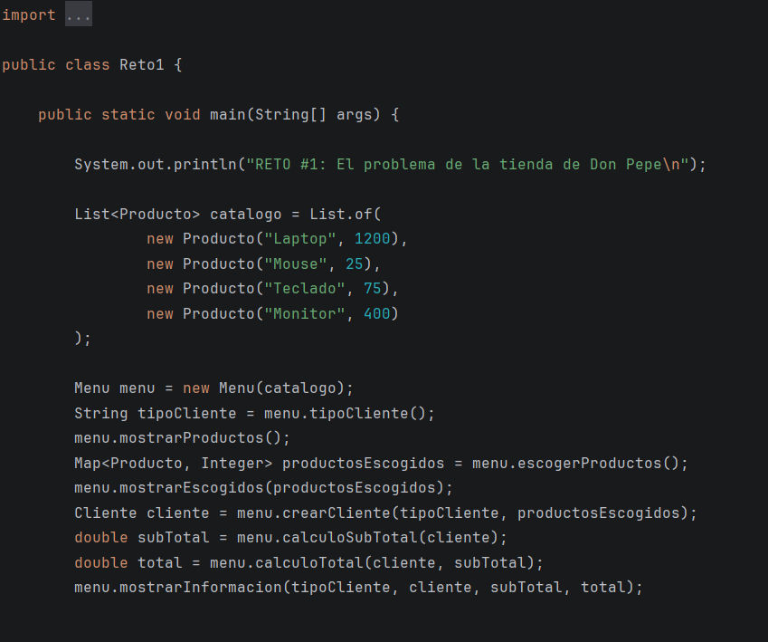
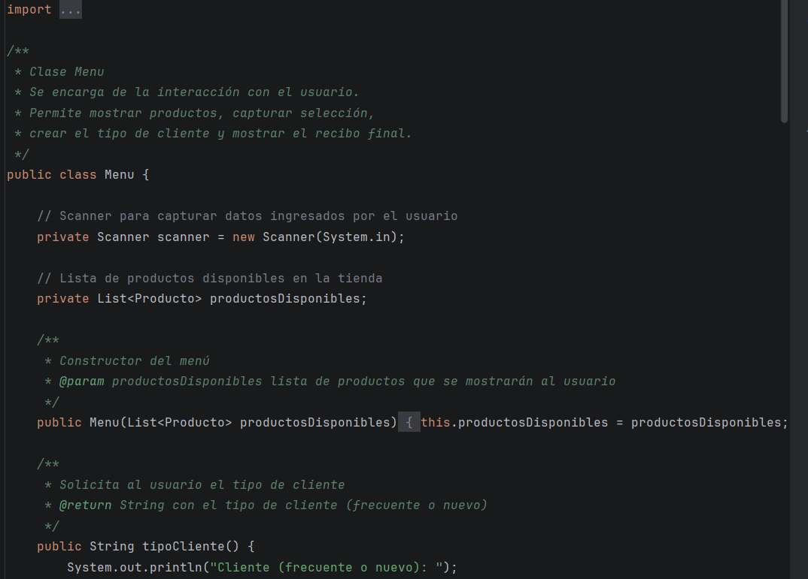

# LABORATORIO 2: SOLID – Patrones de Diseño – Diagramación UML Clases y POO Avanzada

## PREGUNTAS INICIALES:
1. ¿Qué ventaja ofrece el polimorfismo en el diseño de clases frente al uso de
   múltiples condicionales para determinar el comportamiento de un objeto?

El polimorfismo permite que un mismo método tenga diferentes comportamientos según el objeto que lo implemente, evitando el uso de múltiples estructuras condicionales. Esto mejora la legibilidad del código, facilita la extensibilidad del sistema y reduce la posibilidad de errores al agregar nuevos comportamientos sin modificar el código existente.

2. ¿Por qué una clase inmutable puede mejorar la seguridad?

Una clase inmutable mejora la seguridad porque su estado no puede modificarse después de su creación. Esto evita cambios accidentales o no autorizados en los datos, garantiza la consistencia del objeto y facilita el manejo seguro en entornos concurrentes.

3. Según el principio de Abierto/Cerrado, ¿cómo deberíamos modificar el
   sistema si queremos añadir una nueva funcionalidad sin alterar el código
   existente?

Según el principio de Abierto/Cerrado, el sistema debe extenderse mediante nuevas clases o implementaciones, utilizando herencia o interfaces, en lugar de modificar el código ya existente. De esta manera se agregan nuevas funcionalidades sin afectar las ya implementadas.

4. ¿Qué es y por qué usamos el pom.xml?

El archivo pom.xml es el archivo principal de configuración de un proyecto Maven. Se utiliza para definir las dependencias, plugins, versión del proyecto y el ciclo de vida de construcción, permitiendo automatizar y estandarizar el proceso de compilación y empaquetado.

5. ¿Qué diferencia hay entre mvn compile, mvn package y mvn install?

- mvn compile: compila el código fuente del proyecto.

- mvn package: compila el código y genera el archivo empaquetado (JAR o WAR).

- mvn install: compila, empaqueta e instala el artefacto en el repositorio local de Maven para que pueda ser usado por otros proyectos.

6. ¿Qué diferencia existe entre una interfaz y una clase abstracta?

Una interfaz define un conjunto de métodos que una clase debe implementar, sin proporcionar implementación ni estado. Una clase abstracta puede contener métodos abstractos y métodos con implementación, así como atributos, y sirve como una base común para clases relacionadas.

## Retos completados
### Reto 1 – El problema de la tienda de Don Pepe

#### Evidencia del código solución implementado

  
  

  
  

  
  

  
  

  

---

#### Evidencia de la respuesta ejecutada

  
  

#### Lo solicitado en cada Reto

**¿Cómo está aplicando en su solución cada uno de los principios SOLID?**
En la solución se aplican los principios SOLID porque cada clase tiene una función específica (por ejemplo, `Producto` solo representa datos y `Descuento` solo aplica descuentos). Además, el sistema permite agregar nuevos tipos de descuento sin modificar las clases existentes, cumpliendo el principio Abierto/Cerrado. La clase `Cliente` trabaja con la abstracción `Descuento` en lugar de depender de clases concretas, lo que hace el diseño más flexible y organizado.

**¿Cómo están aplicando polimorfismo en tu solución?**
El polimorfismo se aplica cuando el programa usa la interfaz `Descuento` sin saber qué tipo específico de descuento está ejecutando. Dependiendo del tipo de cliente, se aplica automáticamente el descuento correspondiente (nuevo o antiguo), sin necesidad de usar condicionales.

---

### Reto 2 – El chef de 5 estrellas

#### Evidencia del código solución implementado

  
  

  
  

  
  

#### Evidencia de la respuesta ejecutada

**Entrada**

  

**Salida**

  

#### Lo solicitado en cada Reto
##### Categoría del patrón de diseño
Creacional

##### Patrón Utilizado
Builder

##### Justificación
La hamburguesa tiene muchos ingredientes, por lo que sería necesario crear muchos constructores para cada combinación posible. El patrón Builder permite construir objetos complejos paso a paso, evitando constructores largos y mejorando la legibilidad del código.

##### ¿Cómo lo aplicó?
Se aplicó mediante una interfaz que define todos los métodos de construcción. Luego, una clase concreta implementa esta interfaz y sobreescribe los métodos. Finalmente, se utilizó un director (la clase `Chef`) para controlar el proceso de construcción.

---

### Reto 3 – El Reino de los Vehículos

#### Evidencia del código solución implementado

*(Agregar capturas si las tienes)*

#### Evidencia de la respuesta ejecutada

*(Agregar capturas si las tienes)*

### Evidencia de la respuesta ejecutada

**Entrada**

  
  

**Salida**

  

#### Lo solicitado en cada Reto

##### Categoría del patrón de diseño
Patrones Creacionales

##### Patrón Utilizado
Abstract Factory

##### Justificación
Se implementó el patrón Abstract Factory para desacoplar el proceso de creación de los distintos tipos de vehículos del resto de la aplicación. Dado que el sistema maneja familias de objetos relacionados (vehículos terrestres, acuáticos y aéreos), este patrón permite crear dichos objetos sin que el cliente conozca las clases concretas que se instancian. Esto facilita la extensibilidad, cumple con el principio Abierto/Cerrado y reduce el acoplamiento.

##### ¿Cómo lo aplicó?
Se definió una interfaz de fábrica abstracta (`VehicleFactory`) con métodos para crear vehículos. Luego, se implementaron fábricas concretas como `LandVehicleFactory`, `WaterVehicleFactory` y `AirVehicleFactory`, cada una encargada de crear una familia específica de vehículos. Las clases concretas (`Car`, `Bike`, `Boat`, `Plane`, etc.) extienden de una clase abstracta `Vehicle`, garantizando coherencia dentro de cada familia.

---

### Reto 4 – La Estafa de la Casa de Cambio

#### Evidencia del código solución implementado

*(Agregar capturas si las tienes)*

### Evidencia de la respuesta ejecutada

**Entrada**

  

**Salida**

  

#### Lo solicitado en cada Reto

##### Categoría del patrón de diseño
Patrones Estructurales

##### Patrón Utilizado
Adapter

##### Justificación
Se utilizó el patrón Adapter porque el sistema necesitaba integrar un servicio de conversión de tasas reales cuya interfaz no coincidía con la forma en que el cliente requería realizar las conversiones. Este patrón permite adaptar una clase existente a una nueva interfaz sin modificar su código, facilita la extensibilidad y encapsula la lógica de adaptación.

##### ¿Cómo lo aplicó?
1. **Interfaz objetivo (Target):** `CurrencyConverter`, utilizada por el cliente.
2. **Adaptee:** `RealExchangeRateService`, encargado de manejar las tasas reales de conversión.
3. **Adapter:** `ExchangeAdapter`, que implementa `CurrencyConverter` y traduce las llamadas del cliente al formato esperado por el servicio real.
4. **Cliente:** Interactúa únicamente con `CurrencyConverter`, sin conocer la implementación concreta.

---

### RETO #5: El Café Personalizado

#### Evidencia del código solución implementado

  
  

  
  

  
  

  
  

#### Evidencia de la respuesta ejecutada

**Entrada**

  

**Salida**

  

#### Lo solicitado en cada Reto

##### Categoría del patrón de diseño
ESTRUCTURALES

##### Patrón Utilizado
DECORATOR

##### Justificación
El patrón Decorator permite añadir responsabilidades adicionales a un objeto de manera dinámica sin alterar su estructura original. Esto es útil cuando se desea extender la funcionalidad de una clase sin modificar su código, promoviendo la adherencia al principio de Abierto/Cerrado.
En este caso de los cafes se utiliza el patrón Decorator para añadir diferentes tipos de ingredientes (como leche, azúcar, etc.) a una bebida base (como café o té) sin modificar las clases originales de las bebidas. evitando la proliferación de subclases para cada combinación posible de ingredientes.

##### ¿Cómo lo aplicó?
Se creó una interfaz base para las bebidas y luego se implementaron clases concretas para cada tipo de bebida. A continuación, se crearon clases decoradoras que implementan la misma interfaz y añaden ingredientes adicionales a la bebida base. Cada decorador envuelve una instancia de la bebida original y añade su propio comportamiento (como el costo adicional y la descripción del ingrediente) antes de delegar las llamadas al objeto original.

---

### RETO #6: Habla con Soporte Técnico

#### Evidencia del código solución implementado

  
  

  
  

  
  

  

#### Evidencia de la respuesta ejecutada

**Entrada**

  

**Salida**

  

#### Lo solicitado en cada Reto

##### Categoría del patrón de diseño
COMPORTAMIENTO

##### Patrón Utilizado
CHAIN OF RESPONSABILITY

##### Justificación
Se utilizó el patrón **Chain of Responsibility** porque el sistema de soporte técnico requiere que los tickets sean procesados por distintos técnicos según su nivel de dificultad y prioridad, sin que el cliente conozca quién los resolverá específicamente.

Este patrón permite que cada técnico evalúe si puede atender el ticket y, en caso contrario, lo delegue automáticamente al siguiente en la cadena. De esta manera, se logra un diseño desacoplado, flexible y escalable, donde es posible agregar nuevos técnicos o modificar la cadena sin afectar la lógica del cliente.

Además, favorece el cumplimiento de los principios **Open/Closed** (abierto a extensión, cerrado a modificación) y **Responsabilidad Única**, ya que cada técnico se encarga únicamente de validar y procesar los tickets que le corresponden.

##### ¿Cómo lo aplicó?
Se implementó una interfaz común para los técnicos (Handler), que define el método para procesar el ticket y establecer el siguiente elemento en la cadena.

Posteriormente, se creó una clase base que contiene la referencia al siguiente técnico y la lógica de delegación cuando el ticket no puede ser resuelto.

Se desarrollaron clases concretas (Técnico Básico, Técnico Intermedio y Técnico Avanzado), donde cada una implementa su propia lógica de validación según el nivel de dificultad y prioridad del ticket. Si el técnico no puede resolverlo, lo pasa al siguiente en la cadena.

El cliente únicamente envía el ticket al primer técnico, permitiendo que el procesamiento fluya dinámicamente hasta que sea resuelto o marcado como pendiente de escalamiento.

  
  

  
  

  
  

  
  

  

---

  
  

  
  

  
  

  
  

**Entrada**

  

**Salida**

  

##### Categoría del patrón de diseño
Creacional
##### Patrón Utilizado
Builder
##### Justificación
##### ¿Cómo lo aplicó?

### Evidencia de la respuesta ejecutada

**Entrada**

  
  

**Salida**

  

##### Categoría del patrón de diseño
Patrones Creacionales
##### Patrón Utilizado
Abstract Factory

##### Justificación
##### ¿Cómo lo aplicó?
### Evidencia de la respuesta ejecutada

**Entrada**

  

**Salida**

  

##### Categoría del patrón de diseño
Patrones Estructurales
##### Patrón Utilizado
Adapter

##### Justificación
##### ¿Cómo lo aplicó?
---

  
  

  
  

  
  

  
  

**Entrada**

  

**Salida**

  

ESTRUCTURALES

DECORATOR

El patrón Decorator permite añadir responsabilidades adicionales a un objeto de manera dinámica sin alterar su estructura original. Esto es útil cuando se desea extender la funcionalidad de una clase sin modificar su código, promoviendo la adherencia al principio de Abierto/Cerrado.
En este caso de los cafes se utiliza el patrón Decorator para añadir diferentes tipos de ingredientes (como leche, azúcar, etc.) a una bebida base (como café o té) sin modificar las clases originales de las bebidas. evitando la proliferación de subclases para cada combinación posible de ingredientes.
Se creó una interfaz base para las bebidas y luego se implementaron clases concretas para cada tipo de bebida. A continuación, se crearon clases decoradoras que implementan la misma interfaz y añaden ingredientes adicionales a la bebida base. Cada decorador envuelve una instancia de la bebida original y añade su propio comportamiento (como el costo adicional y la descripción del ingrediente) antes de delegar las llamadas al objeto original.

---

  
  

  
  

  
  

  

**Entrada**

  

**Salida**

  

COMPORTAMIENTO

CHAIN OF RESPONSABILITY

Se utilizó el patrón **Chain of Responsibility** porque el sistema de soporte técnico requiere que los tickets sean procesados por distintos técnicos según su nivel de dificultad y prioridad, sin que el cliente conozca quién los resolverá específicamente.

Este patrón permite que cada técnico evalúe si puede atender el ticket y, en caso contrario, lo delegue automáticamente al siguiente en la cadena. De esta manera, se logra un diseño desacoplado, flexible y escalable, donde es posible agregar nuevos técnicos o modificar la cadena sin afectar la lógica del cliente.

Además, favorece el cumplimiento de los principios **Open/Closed** (abierto a extensión, cerrado a modificación) y **Responsabilidad Única**, ya que cada técnico se encarga únicamente de validar y procesar los tickets que le corresponden.

Se implementó una interfaz común para los técnicos (Handler), que define el método para procesar el ticket y establecer el siguiente elemento en la cadena.
Posteriormente, se creó una clase base que contiene la referencia al siguiente técnico y la lógica de delegación cuando el ticket no puede ser resuelto.

Se desarrollaron clases concretas (Técnico Básico, Técnico Intermedio y Técnico Avanzado), donde cada una implementa su propia lógica de validación según el nivel de dificultad y prioridad del ticket. Si el técnico no puede resolverlo, lo pasa al siguiente en la cadena.

El cliente únicamente envía el ticket al primer técnico, permitiendo que el procesamiento fluya dinámicamente hasta que sea resuelto o marcado como pendiente de escalamiento.
