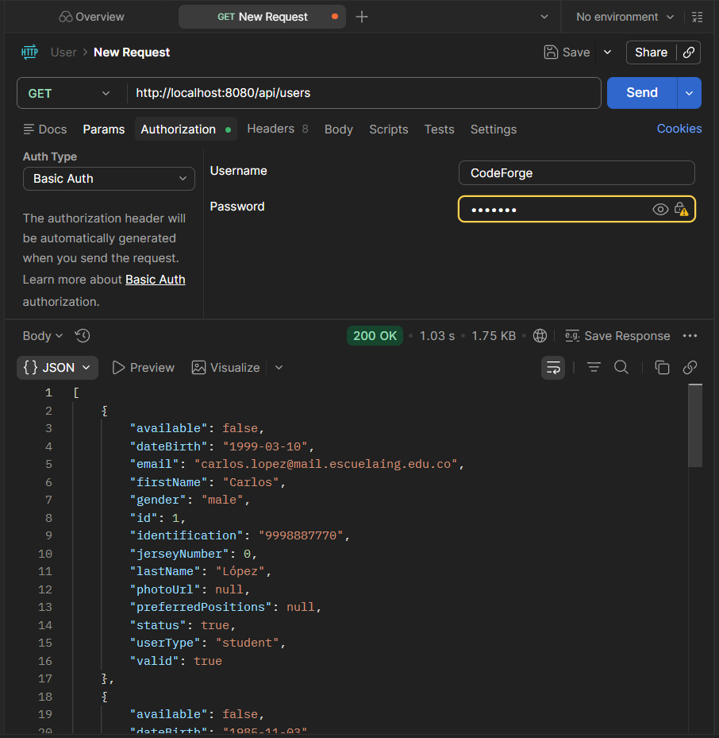

# TECHCUP FUTBOL

> [!IMPORTANT]
> This repository contains the **Backend service** for the **TECHCUP-FUTBOL** project.

---

## 🧰 Technologies

| Technology | Description |
| ---------- | ----------- |
| **Java 17+** | Main programming language used to develop the backend application |
| **Spring Boot** | Framework that simplifies the development of Java applications and RESTful APIs |
| **Maven** | Dependency management and build automation tool used to build and manage the project |
| **Swagger UI** | Provides interactive API documentation and allows developers to test endpoints directly from the browser |
| **JaCoCo** | Tool used to measure test coverage within the codebase |
| **SonarQube** | Static code analysis platform used to detect bugs, vulnerabilities, and maintain code quality |
| **Swagger (OpenAPI)** | Interactive API documentation used to explore and test REST endpoints directly from the browser (Swagger UI) |

## 📁 Project structure

```
📦 TECHCUP-FUTBOL-BackEnd-SpringBoot/
├── 📂 src/
│   ├── 📂 main/
│   │   ├── 📂 java/
│   │   │   └── 📂 edu/eci/dosw/project-name/
│   │   │       ├── 📄 Application.java        # Main class with @SpringBootApplication
│   │   │       ├── 📂 config/                 # Configuration (Security, Web, etc.)
│   │   │       ├── 📂 controller/             # REST controllers (@RestController)
│   │   │       ├── 📂 service/                # Business logic (@Service)
│   │   │       ├── 📂 repository/             # Data access (@Repository / JPA)
│   │   │       ├── 📂 entity/                 # JPA entities (database layer)
│   │   │       ├── 📂 model/                  # Core domain models
│   │   │       ├── 📂 dto/                    # Data Transfer Objects
│   │   │       └── 📂 exception/              # Exception handling (@ControllerAdvice)
│   │   └── 📂 resources/
│   │       ├── 📄 application.properties     # or application.yml
│   │       └── 📂 docs/
│   │           ├── 📂 uml/
│   │           ├── 📂 images/
│   │           └── 📂 requirements/
│   └── 📂 test/
│       └── 📂 java/                          # Tests (same package structure)
├── 📄 pom.xml                                # Maven configuration
└── 📄 README.md
``` 

# Laboratorio-9

## Parte 1

1. Postman


## Parte 2

4. Request de Users en Postman solicitando usuario y contraseña


7. Resultado de la solicitud de autenticación con el token JWT


12. Resultado de la solicitud de autenticación con el token JWT configurado usuario y contraseña

