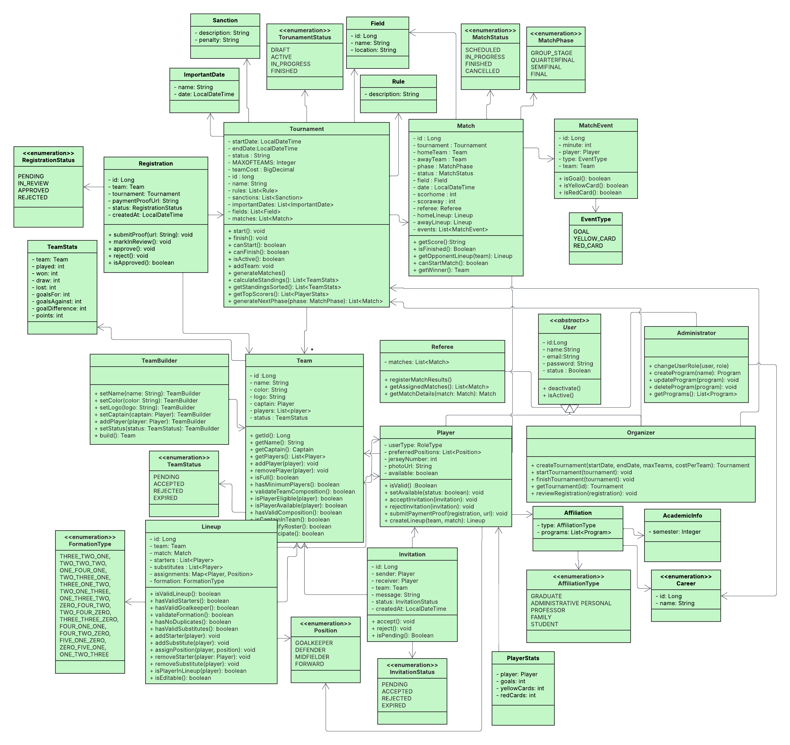
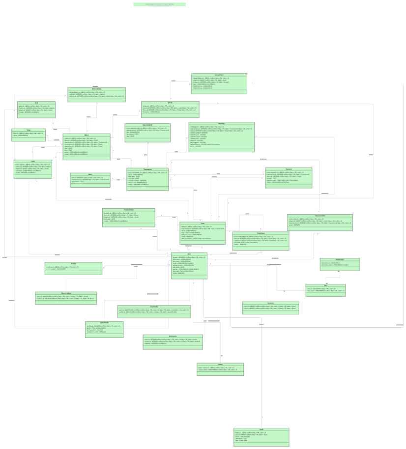

# TechCup Fútbol: Backend (Spring Boot)

    

Backend del proyecto TechCup Fútbol: API REST para la gestión de torneos de fútbol, equipos, jugadores, partidos y usuarios, con autenticación JWT.

## Autores

JUAN SEBASTIÁN GUAYAZÁN CLAVIJO, BRAYAN LOAIZA, JUAN CRUZ, JUAN JOSÉ LAVERDE y JUAN MANUEL VILLEGAS
Desarrollo y Operaciones Software (ISIS DOSW-301)
Decanatura Ingeniería de Sistemas
Ingeniería de Sistemas
Escuela Colombiana de Ingeniería Julio Garavito
2026-1

## Estructura del proyecto

```
TECHCUP-FUTBOL-BackEnd-SpringBoot/
├── pom.xml
├── src/main/java/edu/eci/dosw/tech_cup/
│   ├── TechCupApplication.java
│   ├── config/SwaggerConfig.java
│   ├── controller/          # AuthController, TeamController, TournamentController, UserController
│   ├── security/            # JwtAuthenticationFilter, SecurityConfig
│   ├── service/             # JwtService, TeamService, TournamentService, UserService (+ interfaces)
│   ├── repository/          # TeamRepository, TournamentRepository, UserRepository, TeamPlayerRepository
│   ├── entity/               # TeamEntity, TournamentEntity, UserEntity, RoleEntity, PermissionEntity, TeamPlayerEntity
│   ├── model/                 # ~35 modelos de dominio: torneos, partidos, equipos, jugadores, árbitros, sanciones, etc.
│   ├── mapper/                 # TeamMapper, TournamentMapper, UserMapper
│   └── dto/                    # LoginRequest
├── src/main/resources/
│   └── docs/
│       ├── uml/                # Diagramas de clases, ER, casos de uso
│       ├── planning/            # Desglose de trabajo, acuerdos de equipo
│       ├── requirements/         # Alcance y requerimientos
│       └── laboratories/          # Notas de los laboratorios del curso aplicados al proyecto
└── src/test/java/edu/eci/dosw/tech_cup/
    ├── controller/AuthIntegrationTest.java
    ├── repository/               # Tests de TeamRepository, TournamentRepository, UserRepository
    └── service/                  # Tests de TeamService, TournamentService, UserService
```

## Cómo ejecutar

```bash
git clone https://github.com/CodeForge-DOSW/TECHCUP-FUTBOL-BackEnd-SpringBoot.git
cd TECHCUP-FUTBOL-BackEnd-SpringBoot
```

```bash
./mvnw spring-boot:run
./mvnw test
```

Documentación interactiva de la API disponible en Swagger UI una vez la aplicación está corriendo.

## Contexto y conceptos clave

### Resumen

Backend del sistema de gestión de torneos de fútbol TechCup: administra torneos, equipos, invitaciones de jugadores, partidos (alineaciones, eventos, resultados) y usuarios, con control de acceso basado en roles y permisos. La autenticación se implementa con JWT: `AuthController` expone el login, `JwtService` genera y valida los tokens, y `JwtAuthenticationFilter` intercepta cada solicitud para autenticar al usuario antes de llegar a los controladores protegidos.

### Conceptos clave

- API REST con Spring Boot (`@RestController`, `@Service`, `@Repository`)
- Autenticación y autorización con JWT (filtro de seguridad, `SecurityConfig`)
- Modelo de dominio de un sistema de torneos deportivos: equipos, jugadores, partidos, árbitros, sanciones, tabla de posiciones
- Mapeo entre entidades de persistencia y modelos de dominio (`mapper/`)
- Documentación de API con Swagger/OpenAPI
- Diseño respaldado por diagramas UML (clases, entidad-relación, casos de uso) versionados en `docs/uml/`

### Filtro JWT

Un filtro JWT es un componente del pipeline de seguridad de Spring Security que intercepta cada solicitud HTTP para leer y procesar el token JWT enviado por el cliente: valida su autenticidad e integridad, extrae la identidad del usuario y registra su autenticación en el contexto de seguridad. Gracias a esto, los endpoints protegidos pueden autorizar o rechazar solicitudes sin manejar sesiones tradicionales en el servidor.

### Resultados

La API expone endpoints de autenticación (login con JWT), gestión de equipos, torneos y usuarios, con pruebas de integración y unitarias sobre los repositorios y servicios principales.

## Diagramas

### Diagrama de clases



### Diagrama entidad-relación



Diagramas de casos de uso adicionales en [`docs/uml/useCase/`](src/main/resources/docs/uml/useCase/).
