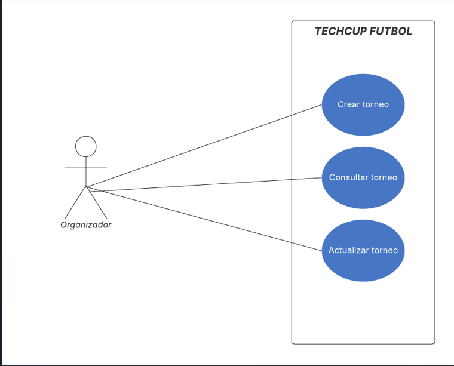
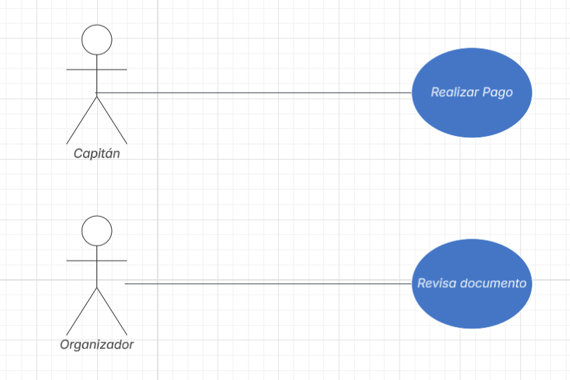
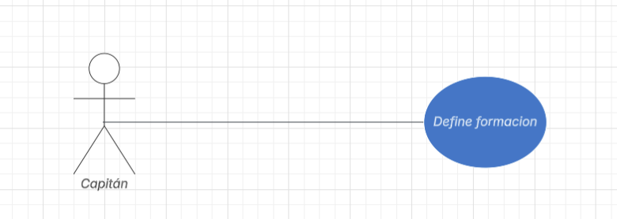
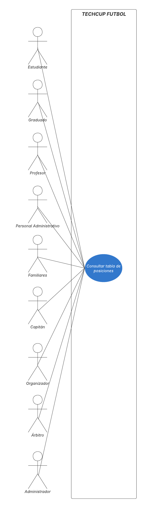

# 📄 Requerimientos del Sistema

## 1. Lista general de requerimientos

El sistema de TECHCUP FUTBOL tiene los siguientes requerimientos (descripción a alto nivel):

### 1.1 Requerimientos funcionales

El sistema de Bankify debe tener la capacidad de:

1. Gestión del Torneo

2. Registro y Autenticación de Usuarios

3. Gestión de Roles

4. Creación y Administración de Equipos

5. Gestión de Invitaciones

6. Búsqueda de Jugadores

7. Gestión de Inscripción y Pagos

8. Gestión de Alineaciones
   
9.  Gestión Partidos

10. Tabla de Posiciones Automática

11. Generación de Llaves Eliminatorias

12. Estadísticas e Historial

13. Auditoría

### 1.2 Requerimientos NO funcionales

El sistema de TECHCUP FUTBOL debe tener:

1. Seguridad en la autenticación y autorización, garantizando control de acceso basado en roles y protección de datos sensibles.
2. Disponibilidad durante el desarrollo del torneo, evitando caídas frecuentes del sistema.
3. Diseño adaptable (responsive) para que pueda usarse desde computador y celular.
4. Una identidad visual definida que respete los colores institucionales establecidos en el manual de identidad.+
5. Buen rendimiento, respondiendo de manera rápida a las acciones del usuario.

### 2.1 Requerimiento Funcional 1

| Campo | Descripción |
|-------|-------------|
| **ID**| RF-01 |
| **Nombre del requerimiento** | Gestión Integral del Torneo |
| **Descripción** | *El sistema debe permitir a los organizadores crear, consultar, actualizar y cancelar torneos, definiendo sus características, reglamento, fechas y estado dentro de la plataforma.* |
| **Precondiciones** | *Para que el sistema cumpla con este requerimiento, TECHCUP debe tener usuarios registrados con rol de Organizador o Administrador y acceso autenticado al sistema.* |
| **Actor** | Organizador / Administrador |
| **Flujo principal** | 1. El actor accede al módulo de gestión de torneos. 2. El sistema muestra las opciones de crear, consultar, actualizar o cancelar torneo. 3. El actor registra o modifica la información del torneo. 4. El sistema valida los datos ingresados. 5. El sistema guarda los cambios y actualiza el estado del torneo. 6. El sistema confirma la operación realizada | 
| **Diagrama de caso de uso**  | . |
| **Poscondiciones** | *Se espera como resultado que el torneo quede registrado o actualizado correctamente y disponible para su consulta según los permisos definidos.* |
### 2.2 Requerimiento Funcional 2

| Campo | Descripción |
|-------|-------------|
| **ID** | RF-02 |
| **Nombre del requerimiento** | Registro y Autenticación de Usuarios |
| **Descripción** | El sistema debe permitir que cualquier persona interesada pueda crear su cuenta, iniciar sesión de forma segura y configurar su perfil deportivo con foto, número dorsal y posiciones de juego. También podrá indicar si está disponible para unirse a un equipo. |
| **Precondiciones** | Para que el sistema cumpla con este requerimiento, el usuario debe contar con un correo institucional estudiante, graduado, profesor o personal administrativo o un correo Gmail si es familiar de alguien de la Escuela. |
| **Actor** | Estudiante, Graduado, Profesor, Personal Administrativo, Familiar |
| **Flujo principal** | 1. El usuario ingresa a la plataforma y selecciona la opción de registro. 2. El usuario ingresa su correo y completa los datos del formulario. 3. El sistema valida el tipo de correo y asigna el rol correspondiente. 4. El usuario completa su perfil deportivo (foto, dorsal, posiciones de juego). 5. El sistema guarda la información y activa la cuenta. 6. El usuario inicia sesión con sus credenciales. 7. El usuario puede marcar su disponibilidad para que los capitanes lo encuentren. |
| **Diagrama de caso de uso** ||
| **Poscondiciones** | El usuario queda registrado con su perfil deportivo activo y el rol asignado según el tipo de correo con el que se registró. |

### 2.3 Requerimiento Funcional 3

| Campo | Descripción |
|-------|-------------|
| **ID** | RF-03 |
| **Nombre del requerimiento** | Gestión de Roles |
| **Descripción** | El sistema debe manejar diferentes tipos de usuarios, donde cada uno tiene acceso únicamente a lo que le corresponde según su rol. No todos pueden realizar las mismas acciones dentro de la plataforma. |
| **Precondiciones** | Para que el sistema cumpla con este requerimiento, el usuario debe estar previamente registrado y autenticado en la plataforma. |
| **Actor** | Administrador, Organizador, Capitán, Árbitro, Estudiante, Graduado, Profesor, Personal Administrativo, Familiar |
| **Flujo principal** | 1. El usuario inicia sesión en la plataforma. 2. El sistema identifica el rol asignado a ese usuario. 3. El sistema muestra únicamente las opciones que le corresponden según su rol. 4. Si el usuario intenta acceder a una función que no le pertenece, el sistema le niega el acceso. 5. El administrador puede consultar, crear o modificar los roles cuando sea necesario. 6. Cualquier cambio de rol queda registrado en el sistema para auditoría. |
| **Diagrama de caso de uso** ||
| **Poscondiciones** | Cada usuario accede únicamente a las funciones que le corresponden, garantizando que la información y acciones del torneo estén controladas y organizadas. |

### 2.4 Requerimiento Funcional 4

| Campo | Descripción |
|------|-------------|
| **ID** | RF-04 |
| **Nombre del requerimiento** | Creación y Administración de Equipos |
| **Descripción** | *El sistema debe permitir al Capitán crear y configurar un equipo (nombre, escudo y colores), invitar jugadores, gestionar alineaciones y validar que el equipo cumpla las reglas establecidas: mínimo 7 y máximo 12 jugadores y que un jugador no pertenezca a dos equipos, que más de la mitad pertenezcan a los programas autorizados (Ingeniería de Sistemas, Inteligencia Artificial, Ciberseguridad y Estadística), y que no se permitan cambios de jugadores durante el torneo.* |
| **Precondiciones** | *El sistema debe contar con un Capitán autenticado, un equipo previamente creado, jugadores registrados y un torneo en estado de inscripciones abiertas, asegurando además que el jugador no pertenezca a otro equipo.* |
| **Actor** | *Capitán* |
| **Flujo principal** | 1. El capitán crea un equipo. 2. Ingresa nombre, escudo y colores. 3. Invita jugadores. 4. El sistema valida límites y reglas. 5. El sistema confirma equipo válido. |
| **Diagrama de caso de uso** | |
| **Poscondiciones** | *Se espera como resultado que el equipo quede registrado cumpliendo las reglas establecidas.* |

### 2.5 Requerimiento Funcional 5

| Campo | Descripción |
|------|-------------|
| **ID** | RF-05 |
| **Nombre del requerimiento** | Gestión de Invitaciones |
| **Descripción** | *El sistema debe permitir el envío de invitaciones a jugadores por parte del Capitán, así como la aceptación o rechazo de estas invitaciones por parte del jugador, garantizando asi que un jugador solo quede en un único equipo durante el torneo.* |
| **Precondiciones** | *El sistema debe contar con un Capitán autenticado, un equipo previamente creado, jugadores registrados y un torneo en estado de inscripciones abiertas, asegurando además que el jugador no pertenezca a otro equipo.* |
| **Actor** | *Capitán (principal) Jugador (secundario)* |
| **Flujo principal** | 1. El capitán envía invitación. 2. El jugador recibe notificación. 3. El jugador acepta o rechaza. 4. El sistema actualiza el estado del equipo. |
| **Diagrama de caso de uso** | |
| **Poscondiciones** | *Se espera como resultado que el jugador quede vinculado o no al equipo según su decisión.* |

### 2.6 Requerimiento Funcional 6

| Campo | Descripción |
|------|-------------|
| **ID** | RF-06 |
| **Nombre del requerimiento** | Búsqueda de Jugadores |
| **Descripción** | *El sistema debe permitir buscar jugadores aplicando filtros por posición, semestre, edad, género, nombre e identificación, mostrando como resultado la lista de jugadores que coincidan con los criterios ingresados* |
| **Precondiciones** | *El sistema debe tener jugadores previamente registrados con su información deportiva completa y un usuario autenticado con permisos para realizar búsquedas.* |
| **Actor** | *Capitán* |
| **Flujo principal** | 1. El capitán accede al módulo de búsqueda. 2. Ingresa filtros. 3. El sistema muestra resultados coincidentes. |
| **Diagrama de caso de uso** ||
| **Poscondiciones** | *Se espera como resultado que se muestra la lista filtrada de jugadores disponibles.* |

### 2.7 Requerimiento Funcional 7

| Campo | Descripción |
|------|-------------|
| **ID** | RF-07 |
| **Nombre del requerimiento** | Gestión de Inscripción y Pagos |
| **Descripción** | El sistema debe permitir: Subir comprobante de pago,Cambiar estado del pago (Pendiente, En revisión, Aprobado, Rechazado), Autorizar participación solo a equipos aprobados. |
| **Precondiciones** | 	El equipo debe estar creado y el capitán autenticado. |
| **Actor** | Capitán, Organizador|
| **Flujo principal** | 1. El capitán sube el comprobante.  2. El sistema registra el estado como Pendiente. 3. El organizador revisa el comprobante. 4. El sistema actualiza el estado a Aprobado o Rechazado. |
| **Diagrama de caso de uso** |  |
| **Poscondiciones** | El equipo queda habilitado o rechazado para participar. |

### 2.8 Requerimiento Funcional 8

| Campo | Descripción |
|------|-------------|
| **ID** | RF-08 |
| **Nombre del requerimiento** | Gestión de Alineaciones |
| **Descripción** | 	El sistema debe permitir seleccionar titulares, reservas, formación y consultar alineaciones rivales. |
| **Precondiciones** | 	El equipo debe estar inscrito y aprobado.|
| **Actor** | Capitán |
| **Flujo principal** | 1. El capitán accede a la alineación.  2. Selecciona titulares y reservas.  3. Define formación.  4. El sistema guarda la alineación.|
| **Diagrama de caso de uso** |  |
| **Poscondiciones** | 	La alineación queda registrada para el partido. |

### 2.9 Requerimiento Funcional 9

| Campo | Descripción |
|------|--------------|
| **ID** | RF-09|
| **Nombre del requerimiento** | Gestión de Partidos|
| **Descripción** | El sistema debe permitir gestionar la información de los partidos del torneo, incluyendo la consulta de los partidos asignados y el registro de resultados, marcador final y estadísticas como goleadores y tarjetas.|
| **Precondiciones** | Para que el sistema cumpla con este requerimiento, TECHCUP-FUTBOL debe tener previamente programados los partidos, con equipos participantes, árbitros asignados y canchas disponibles.|
| **Actor** | Organizador, Árbitro |
| **Flujo principal** | 1. El organizador accede al módulo de partidos. 2. Selecciona el partido correspondiente. 3. Ingresa el marcador final. 4. Registra estadísticas (goleadores y tarjetas). 5. El sistema actualiza la información del partido |
| **Diagrama de caso de uso** ||
| **Poscondiciones** | Se espera como resultado que la información del partido quede actualizada y disponible para su consulta por los actores del sistema. |

### 2.10 Requerimiento Funcional 10

| Campo | Descripción |
|------|------------|
| **ID** | RF-010|
| **Nombre del requerimiento** | Tabla de Posiciones Automática|
| **Descripción** | El sistema debe calcular automáticamente la tabla de posiciones del torneo, actualizando estadísticas como puntos, partidos jugados, victorias, empates, derrotas, goles a favor y goles en contra, cada vez que se registre o modifique el resultado de un partido. |
| **Precondiciones** | Para que el sistema cumpla con este requerimiento, TECHCUP-FUTBOL debe tener previamente registro de partidos |
| **Actor** | Organizador|
| **Flujo principal** | 1. El usuario inicia sesión en el sistema  2. El usuario accede al panel principal del torneo. 3. El usuario selecciona la opción **“Tabla de posiciones”** en el menú del sistema 4. El sistema verifica si existen resultados de partidos registrados 5. El sistema calcula o actualiza automáticamente las estadísticas de los equipos del torneo 6. El sistema muestra la tabla de posiciones actualizada con la clasificación de los equipos|
| **Diagrama de caso de uso** | |
| **Poscondiciones** | *Se espera como resultado la tabla de posiciones queda actualizada automáticamente y disponible para consulta|

### 2.11 Requerimiento Funcional 11
| Campo | Descripción |
|-------|-------------|
| **ID** | RF-11 |
| **Nombre del requerimiento** | Generación de Llaves Eliminatorias |
| **Descripción** | El sistema debe generar automáticamente la fase eliminatoria del torneo una vez finalizada la fase de grupos. Esto incluye: generar los partidos iniciales de la fase eliminatoria de forma aleatoria, y generar automáticamente los cruces de cuartos de final, semifinal y final a medida que avanzan los resultados. |
| **Precondiciones** | Para que el sistema cumpla con este requerimiento, TECHCUP FÚTBOL debe tener previamente: un torneo en estado *En progreso*, la fase de grupos completamente finalizada con todos los resultados registrados, y al menos cuatro equipos clasificados para la fase eliminatoria. |
| **Actor** | Organizador (disparador) / Sistema (ejecutor automático) |
| **Flujo principal** | 1. El Organizador indica al sistema que la fase de grupos ha finalizado. 2. El sistema valida que todos los partidos de la fase de grupos tengan resultado registrado. 3. El sistema selecciona aleatoriamente los cruces de la primera ronda eliminatoria. 4. El sistema genera y publica la llave eliminatoria visible para todos los actores. 5. El Organizador registra el resultado de cada partido eliminatorio. 6. El sistema avanza automáticamente a la siguiente ronda (cuartos → semifinal → final). 7. El sistema publica al campeón al finalizar la final. |
| **Diagrama de caso de uso** | 
| **Poscondiciones** | Se espera como resultado: la llave eliminatoria generada y visible para todos los usuarios, los partidos de la ronda inicial creados en el sistema con fecha y cancha pendiente de asignar, y el torneo avanzando automáticamente de ronda en ronda conforme se registran resultados. |

### 2.12 Requerimiento Funcional 12

| Campo | Descripción |
|-------|-------------|
| **ID** | RF-12 |
| **Nombre del requerimiento** | Estadísticas e Historial |
| **Descripción** | El sistema debe permitir consultar información estadística e histórica del torneo, incluyendo: máximos goleadores del torneo en curso e histórico, historial completo de partidos con resultados y detalles, resultados por equipo (partidos ganados, empatados, perdidos, goles a favor y en contra), e historial de torneos anteriores con sus respectivos campeones y estadísticas. |
| **Precondiciones** | Para que el sistema cumpla con este requerimiento, TECHCUP FÚTBOL debe tener previamente: al menos un torneo creado (en progreso o finalizado), al menos un partido con resultado registrado, y el usuario autenticado con una sesión activa válida. |
| **Actor** | Usuario (cualquier rol: Estudiante, Capitán, Organizador, Árbitro o Administrador) |
| **Flujo principal** | 1. El usuario accede a la sección de Estadísticas del sistema. 2. El sistema muestra las estadísticas del torneo activo: tabla de goleadores, resultados y tabla de posiciones. 3. El usuario aplica filtros opcionales por torneo, equipo o jugador. 4. El sistema actualiza la vista con los datos filtrados. 5. El usuario accede a la sección de Historial para consultar torneos anteriores. 6. El sistema muestra los torneos pasados con campeón, resultados finales y estadísticas agregadas. 7. El usuario navega entre torneos para comparar datos históricos. |
| **Diagrama de caso de uso** | 
| **Poscondiciones** | Se espera como resultado: el usuario visualiza las estadísticas solicitadas de forma organizada y actualizada, los datos son calculados automáticamente a partir de los resultados registrados por el Organizador, y el historial de torneos anteriores queda persistido y accesible en cualquier momento. |

### 2.13 Requerimiento Funcional 13
| Campo | Descripción |
|-------|-------------|
| **ID** | RF-13 |
| **Nombre del requerimiento** | Auditoría del Sistema |
| **Descripción** | El sistema debe registrar automáticamente las acciones relevantes realizadas por los usuarios. Cada entrada del log debe incluir: identificación del usuario que realizó la acción, tipo de acción ejecutada (creación, modificación, eliminación o consulta sensible), fecha y hora exacta, entidad o recurso afectado, y estado anterior y posterior del recurso cuando aplique. |
| **Precondiciones** | Para que el sistema cumpla con este requerimiento, TECHCUP FÚTBOL debe tener previamente: el sistema en estado operacional, el módulo de auditoría habilitado en la configuración del sistema, y el usuario con una sesión activa válida al momento de ejecutar la acción. |
| **Actor** | Sistema (ejecutor automático del registro) / Administrador (consultor del log de auditoría) |
| **Flujo principal** | 1. El usuario (cualquier rol) ejecuta una acción relevante dentro del sistema. 2. El sistema intercepta la acción de forma transparente al usuario. 3. El sistema registra en el log: usuario, tipo de acción, fecha y hora, recurso afectado y resultado de la operación. 4. El registro queda persistido de forma inmutable en la base de datos de auditoría. 5. El Administrador accede al módulo de auditoría. 6. El sistema muestra el log completo con opciones de filtrado por usuario, fecha o tipo de acción. 7. El Administrador aplica los filtros deseados y el sistema actualiza la vista del log.
| **Diagrama de caso de uso** | 
| **Poscondiciones** | Se espera como resultado: cada acción relevante queda registrada de forma automática, completa e inmutable, el Administrador puede consultar y filtrar el historial de auditoría en cualquier momento, y el sistema garantiza trazabilidad completa de las operaciones para efectos de seguridad y cumplimiento. |

